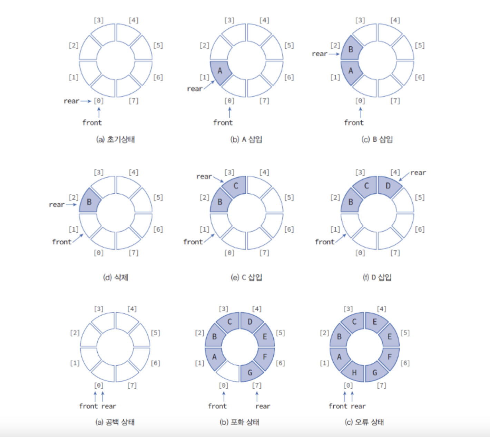

# Stack & Queue

# 스택 (Stack)


 스택은 한 쪽 끝에서만 자료를 넣거나 뺄 수 있는 선형의 자료구조**(LIFO : Last-In First-Out)**입니다. 

자료를 넣는 것을 **push**라 하고 넣어둔 자료를 빼내는 것을 **pop**이라 합니다. 또한, **top**의 데이터를 읽기만 하는 것을 **peek**이라고 합니다. 이 때는 **top**의 변화가 없습니다.

 가장 최근에 스택에 삽입된 자료의 위치를 **top**이라고 하는데, 이 **top**이외에 다른 위치의 데이터에 대한 접근은 불가능합니다.

 스택이 비어있을 때 **pop**을 시도하면 **스택 언더플로우(*Stack Underflow*)**가 발생하고, 스택이 꽉 차있을 때 **push**를 시도하면 **스택 오버플로우(*Stack Overflow*)**가 발생합니다.

### 시간복잡도

**top** 의 위치에 있는 데이터에 바로 접근

- 삽입/삭제 : $O(1)$
- 검색 : $O(n)$

### 장단점

- **top** 의 위치에 바로 접근하기 때문에 데이터 접근, 삽입, 삭제가 빠르다
- **top** 이외의 위치에 접근할 수 없기 때문에 탐색하려면 맞는 데이터가 나올 때까지 데이터를 꺼내야 한다

### 스택의 활용

- 재귀 알고리즘
- 문자열 역순 출력
- 실행 취소 : 가장 나중에 실행된 것부터 실행 취소
- 수식의 괄호 검사

- **스택의 구현**
    
    ```java
    public class Stack {
        int max_size = 0; //스택의 최대 사이즈
        int top = 0;      //스택 맨 꼭대기 인덱스
        int[] stack;      //스택 배열 생성
    
    		//스택 사이즈 결정
        public Stack(int max_size){
            this.max_size = max_size;
            stack = new int[max_size]; 
        }
    
        public void Push(int num){
    				//스택이 다 안 찼을 경우
            if(top<max_size){
                stack[top] = num;
                top++;
            }
            else{
                System.out.println("StackOverflow");
            }
        }
    
        public Object Pop(){
    				//스택에 아직 요소가 남아있을 경우
            if(top>0){
                return stack[--top];
            }
            else{
                System.out.println("StackUnderflow");
                return null;
            }
        }
    }
    ```
    

# 큐 (Queue)


 큐는 입구가 곧 출구인 스택과 달리, 입구와 출구가 별개로 있는 자료구조로, 가장 먼저 들어온 데이터가 가장 먼저 내보내지는 구조**(FIFO : First-In First-Out)**입니다.  

 선형 큐는 데이터를 집어넣는 **offer** 기능과 데이터를 내보내는 **poll** 기능이 있습니다. 

 정해진 한 곳을 이용해서 데이터 처리가 이루어지는 스택과 달리

큐는 삭제연산만 수행하는 프론트**(front)**, 삽입연산만 수행하는 리어**(rear)**로 나뉩니다.

## 선형 큐(Linear Queue)


- 선형 배열을 이용하여 구현한 큐
- 데이터 삽입을 위해서는 요소들을 계속해서 앞으로 이동시켜야 함
- 그렇지 않을 경우 프론트 쪽에 공간이 있더라도 삽입할 수 없을 경우가 발생

## 원형 큐(Circular Queue)



- 선형 큐의 단점을 보완
- **front** = 맨 첫번째 요소 바로 앞을 가리킴
- **rear** = 맨 마지막 요소를 가리킴
- ***front == rear*** : 큐가 공백 상태임을 의미
- ***front == (rear+1) % MAX_QUEUE_SIZE*** : 큐가 포화 상태임을 의미
- 공백 상태와 오류 상태를 구분하기 위해 front를 한칸 비워놓음

### 시간복잡도

- 스택과 동일하게 데이터 삽입, 삭제의 시간복잡도 자체는 $O(1)$.
- 선형 큐의 경우 데이터 요소를 옮겨야할 경우 시간복잡도가 $O(n)$으로 늘어날 수 있음

### 장단점

- 스택과 마찬가지로 데이터에 대한 접근이 빠르다
- **front, rear** 이외의 위치에 접근 자체가 불가능하다

### 큐의 활용

- BFS 알고리즘
- 프로세스 관리
- 대기 순서 관리

- **선형 큐의 구현**
    
    ```java
    public class LinearQueue {
        int maxsize = 0;
        int front = 0;
        int rear = -1;
        int[] LinearQueue;
    
        public LinearQueue(int maxsize){
            this.maxsize=maxsize;
            LinearQueue = new int[maxsize];
        }
    
        public void Offer(int num){
            if(rear != maxsize-1)
                LinearQueue[++rear] = num;
            else
                System.out.println("데이터 삽입 불가");
        }
    
        public int Poll()
        {
            if(rear!=front || (rear==0 && front==0))
            {
                int tmp =LinearQueue[front];
                for(int i=1;i<=rear;i++)
                {
                    LinearQueue[i-1] = LinearQueue[i];
                }
                rear--;
                return tmp;
            }
            else
            {
                return -1;
            }
        }
    }
    ```
    
- **원형 큐의 구현**
    
    ```java
    public class CircularQueue {
        
        int rear = 0;            //최초 0에서부터 시작
        int front = 0;            //최초 0에서부터 시작
        int maxsize = 0;        //배열의 크기
        int[] circularQueue;          //배열
        
        public CircularQueue(int maxsize)
        {
            this.maxsize = maxsize;
            circularQueue = new int[this.maxsize];
        }
        
        public boolean Isempty()    //배열이 공백 상태인지 체크하는 메서드
        {
            if(rear == front)
            {
                return true;
            }
            return false;
        }
        public boolean Isfull()        //배열이 포화 상태인지 체크하는 메서드
        {
            if((rear+1)%maxsize == front)
            {
                return true;
            }
            return false;
        }
        
        public void Offer(int num)
        {
            if(Isfull())            //배열이 포화 상태일 경우
            {
                System.out.println("큐가 가득 찼습니다");
            }
            else                //배열이 포화 상태가 아닐 경우
            {
                rear = (rear+1) % maxsize;
                circularQueue[rear]=num;
            }
        }
        
    public int Poll()
        {
            if(Isempty())         //배열이 공백 상태이면 -1반환
            {
                return -1;
            }
            else                 //배열이 공백 상태가 아니면
            {
                front = (front+1)%maxsize;
                return circularQueue[front];
            }
        }
    }
    ```